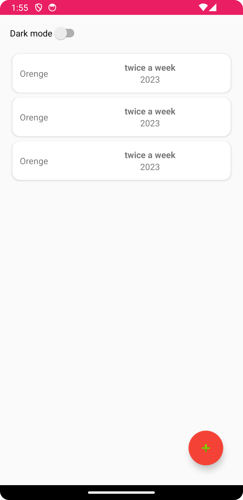
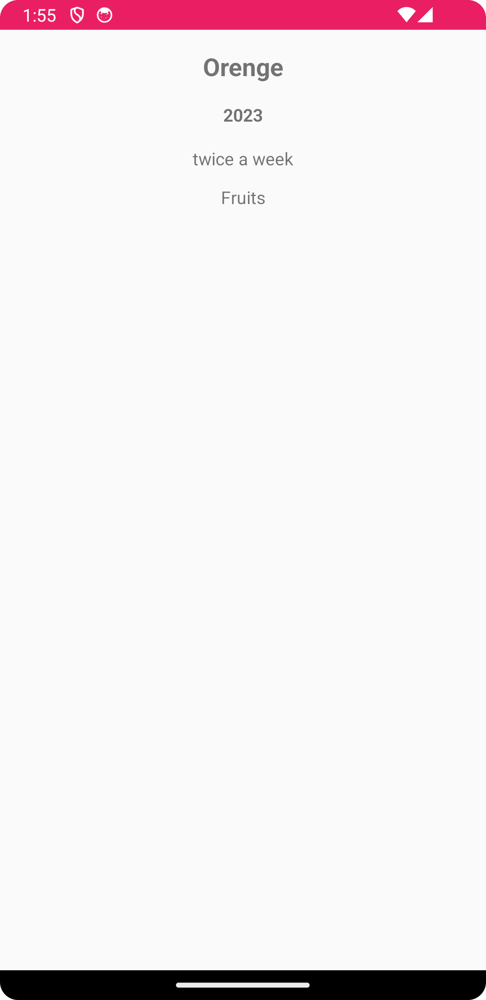
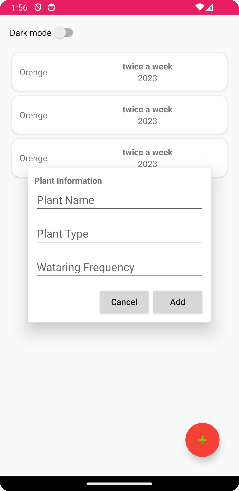

# Gardening Log App with MVVM

# Project Requirement 
-  Java 11 [required]

Using:
- Kotlin
- MVVM architectural pattern
- lifecycle
- LiveData
- RecyclerView
- Retrofit
- Coroutine
- Navigation
- ROOM
- WorkManager
- Dark theme
- Unit Test
- Dependency injection (Hilt)

# Screenshots

  
  
  

